# UKBioBank - SNCA Missense and CNV Analysis

`LNG ❤️ Open Science 😍`

 - **Project:** UKBB CNV 
 - **Author(s):** Cornelis B., Mary M., Hampton L., Mike N. and Andrew S.
 - **Date Last Updated:** July 2020
    - **Update Description:** Edits to README


---
### Quick Description: 
*SNCA* mutation (missense and copy number variant) analysis in the UK biobank using a targeted gene approach

### Motivation/Goals:
1) Understanding and checking how the CNV data looks like in UKbiobank...
2) Check for gene copy number variant in *SNCA* gene region...
3) Check for pathnogenic missense mutations in *SNCA*...

### Background:
*SNCA* is an important gene implicated in Parkinson's disease. Missense mutations and copy number gains (duplications and triplications) have been shown to cause autosomal dominant Parkinson's disease. Here, we screen the UK Biobank cohort for pathogenic missense mutations and copy number variants in *SNCA*. We identified 6 *SNCA* duplications and 6 *SNCA* deletions. Additionally, we also identified ~26 potential mosaic copy number altering events that require follow-up to assess their potential role in Parkinson's disease.

### Link to Manuscript:
Can be found here (not yet)

## Structure of README:
### [1. Downloading Data](#1-Downloading-data)
This section goes through:
-  The approximate size of the B-allele frequency (BAF) and Log 2 Ratio (L2R) directories for *SNCA* 
-  How to download using Biowulf 

### [2. UKbiobank Information and Data Structure](#2-UKbiobank-information-data-structure)
 This section goes through: 
- What type of data you can download to do this analysis
- How the data is structured
- How to read the files
- File structure example

### [3. Check Files](#3-Check-files-if-the-dimensions-make-sense)
- This section goes through:
    - Check if the dimensions make sense for both BAF and L2R
### [4. Diving into Regions of Interest](#4-Diving-into-regions-of-interest)
- #### [4A. SNCA](#SNCA-region-subset)
- #### [4B. Prioritization of sampleIDs](#Prioritization-of-sampleIDs)
This section goes through:
   - How and why to split SNCA into 3 regions to analyze 
   - Background for BAF and how to understand those values (differences between normal, duplication, and triplication)
   - Background for L2R and how to understand those values (differences between normal, duplication, and triplication)
   - What values we are prioritizing moving forward
   - L2R Script (Goals, how to use, inputs, and outputs)
   - BAF Script (Goals, how to use, inputs, and outputs)

### [5. Standalone CNV plotting scripts](#5-Standalone-CNV-plotting-scripts)
This section goes through:
   - Scripts necessary to plot the CNVs
       - How to plot BAF
       - How to plot L2R
   - Necessary files needed for plotting 

### [6. Results Summary](#6-Results-summary)
- #### [6A. SNCA Results](#SNCA-results)
This section goes through:
   - Results from previous steps 
   
### [7. Using Exome Data as Potential Replication?](#7-Using-Exome-data-as-potential-replication)

This section goes through:
   - Background
   - How to download UKBB exome data
   - How to check allelic depth of exomes 
   - How to plot using only high quality variants 
   - Examples
   - Optional: How to convert to hg19 

### [8. ICD10 Code Explorer of CNV Carriers](#8-ICD10-code-explorer-of-CNV-carriers)

This section goes through:
   - How to add ICD10 codes of interest

### [9. Relatedness of CNV Carriers](#9-Relatedness-of-CNV-carriers)

This section goes through:
   - Check for relatedness using PIHAT values from PLINK
   - Check for relatedness using KING 

### [10. Additional Things to Check](#10-Additional-things-to-check)

This section goes through:
   - Are SNCA Mutations on the UKbiobank Array (raw data)?
   - Are SNCA Mutations Identified in the UKbiobank Exome Sequencing Data?
   - Any PD-ish phenotype for these carriers?
   - Annotation using ANNOVAR


---
<a id="1-Downloading-data"></a>
## 1. Downloading Data

These are not small files. For *SNCA*, the sizes of the folders are as follows: 
- 1.4T	BAF/
- 2.3T	L2R/

If using Biowulf, can be downloaded by doing the following: 
```bash
module load ukbb/0.1

for CHROMOSOME_NUMBER in {1..22};
    do
        ukbgene l2r -c"$CHROMOSOME_NUMBER" -a/PATH/TO/KEY/KEYFILE.key
        ukbgene baf -c"$CHROMOSOME_NUMBER" -a/PATH/TO/KEY/KEYFILE.key 
    done
```
<a id="#2-UKbiobank-information-data-structure"></a>
## 2. UKbiobank Information and Data Structure
The copy number variant (CNV) files from UKBB contain:
- **B-alelle frequencies (BAF)** and **log2 ratios (L2R)** that have transformed intensity values to aid with CNV calling
- Separate BAF and L2R files per chromosome 
- Formatted as plain text files that are space-delimited 
    - Rows correspond to different markers (following the structure of the `.bim` file)
    - Columns correspond to the different samples (following the structure of the `.fam` file)
- Missing values are represented by a -1 


CNV File Structure Example: 
| MARKER_ID| SAMPLE1  | SAMPLE2 | SAMPLE3|
| -------- | -------- | --------|--------|
| MARKER_1 | ##       | ##      |##      |
| MARKER_2 | ##       | ##      |##      |
| MARKER_3 | ##       | ##      |##      |
| MARKER_4 | ##       | ##      |##      |
| MARKER_5 | ##       | ##      |##      |
> *Note:* There are no headers or row index names in the files

<a id="3-Check-files-if-the-dimensions-make-sense"></a>
## 3. Check Files
Quick sanity check to see if the dimension of the files downloaded make sense 

SampleIDs in the CNV files follow the `.fam` file structure, check that the number of columns in the CNV files match the number of rows in the `.fam` file.

```bash
# Check dimensions to check if all samples are present 
head -1 ukb_l2r_chr14_v2.txt | tr ' ' '\n' | wc -l
head -1 ukb_baf_chr1_v2.txt | tr ' ' '\n' | wc -l
    # 488377 samples corresponds to .fam file
```

There are separate BAF and L2R files per chromosome, so each chromosome will have a different number of markers. Markers follow the structure of the `.bim` file, and make up the individual rows in the downloaded CNV files 

```bash
# The number of markers is for each file will be different 
	# Markers     CHR
	# 63487	        1
	# 61966	        2
	# 52300	        3
	# 47443	        4
	# 46314	        5
	# 53695	        6
	# 42722	        7
	# 38591	        8
	# 34310	        9
	# 38308	        10
	# 40824	        11
	# 37302	        12
	# 26806	        13
	# 25509	        14
	# 24467	        15
	# 28960	        16
	# 28835	        17
	# 21962	        18
	# 26186	        19
	# 19959	        20
	# 11342	        21
	# 12968	        22
	# 265	        MT
	# 18857	        X
	# 1357	        XY
	# 691	        Y
```

<a id="4-Diving-into-regions-of-interest"></a>
## 4. Diving into Regions of Interest
#### Background 
*SNCA* multiplications are associated Parkinson's disease ([PMID:14593171](https://pubmed.ncbi.nlm.nih.gov/14593171/)). Penetrance is often very high with these mutations... but large scale investigation of these genes hasn't been performed yet 

<a id="SNCA-region-subset"></a>
### 4A. SNCA
#### SNCA Region Subset (hg19) 
1) **Region 1:** *SNCA* gene +/- 5 Mb (chr4:85645250-95759466, hg19)
2) **Region 2:** *SNCA* gene +/- 0.5 Mb (chr4:90145250-91259466, hg19) 
3) **Region 3:** *SNCA* gene body (chr4:90645250-90759466, hg19)

```bash
#######################
# Check the .bim file #
#######################

cd /PATH/TO/UKBIOBANK/CNV_UKB/BIM

head ukb_snp_chr4_v2.bim

awk '$4 > 85645250' ukb_snp_chr4_v2.bim | awk '$4 < 95759466' | wc -l
    # 2373
awk '$4 > 90145250' ukb_snp_chr4_v2.bim | awk '$4 < 91259466' | wc -l
    # 391
awk '$4 > 90645250' ukb_snp_chr4_v2.bim | awk '$4 < 90759466' | wc -l
    # 44

############################################################
# Save the variants out to different .txt files by region  #
############################################################

awk '$4 > 85645250' ukb_snp_chr4_v2.bim | awk '$4 < 95759466' > SNCA_region1_variants.txt
awk '$4 > 90145250' ukb_snp_chr4_v2.bim | awk '$4 < 91259466' > SNCA_region2_variants.txt
awk '$4 > 90645250' ukb_snp_chr4_v2.bim | awk '$4 < 90759466' > SNCA_region3_variants.txt
scp *_variants.txt ../


##########################
# Subsetting BAF and L2R #
##########################

cd /PATH/TO/UKBIOBANK/CNV_UKB/
# Region 1 = 2373 variants
    # from rs62303078 = 21814 (position 1)
    # to rs79456659 = 24186 (position 2)
sed -n 21814,24186p L2R/ukb_l2r_chr4_v2.txt > SNCA_gene_region1_ukb_l2r_chr4_v2.txt
sed -n 21814,24186p BAF/ukb_baf_chr4_v2.txt > SNCA_gene_region1_ukb_baf_chr4_v2.txt

# Region 2 = 391 variants
    # from rs73845905 = 22961 (position 1)
    # to rs79190057 = 23351 (position 2)
sed -n 22961,23351p L2R/ukb_l2r_chr4_v2.txt > SNCA_gene_region2_ukb_l2r_chr4_v2.txt
sed -n 22961,23351p BAF/ukb_baf_chr4_v2.txt > SNCA_gene_region2_ukb_baf_chr4_v2.txt

# Region 3 = 44 variants
    # from rs17180453 = 23164 (position 1)
    # to rs1372519 = 23207 (position 2)
sed -n 23164,23207p L2R/ukb_l2r_chr4_v2.txt > SNCA_gene_region3_ukb_l2r_chr4_v2.txt
sed -n 23164,23207p BAF/ukb_baf_chr4_v2.txt > SNCA_gene_region3_ukb_baf_chr4_v2.txt
```

### Extract BAF and L2R from Large Dataframes and Prioritize Based on these Values for Pdrlotting

#### Background for B-allele Frequencies
BAF (= B allele frequency) values, explained:

| BAF Value| Genotype| Type     |  
| :--------:   | :--------: |:--------:     |
| 0    | AA    | Normal; 2 genotypes      |
| 0.75 | ABBB  | Triplication; 4 genotypes|
| 0.66 | ABB   | Duplication; 3 genotypes |
| 0.5  | AB    | Normal; 2 genotypes      |
| 0.33 | AAB   | Duplication; 3 genotypes |
| 0.25 | AAAB  | Triplication; 4 genotypes|
| 1    | BB    | Normal; 2 genotypes      |


***If there is a duplication,*** (which then means three genotypes) -- for example, AAB -- then this value is 0.33. For ABB, the value would be 0.66. 

***If there is a triplication,*** (which then means four genotypes) -- for example, AAAB -- then this value is 0.25. For ABBB, the value would be 0.75. 

Note that **deletions typically do not have any 0.5 values** because all A genotypes will be 0 and all B genotypes will 1, however this should not be confused with homozygous streches of DNA, where all AA genotypes will be 0 and all B genotypes will 1.


#### Background for log2 R Ratios
L2R (=log R ratio) values, explained:


| L2R Value | Genotypes | Type |
 :--------:   | :--------: |:--------:     |
| Less than 0    | A or B   | Deletion; 1 genotype   |
| 0    | AA, AB, BB    | Normal; 2 genotypes   |
| Greater than 0 | ABB, AAB  | Duplication; 3 genotypes|
| Greater than or equal to 0.75 | ABBB, AAAB  | Triplication; 4 genotypes|


When this value is:
-  ***0*** -- this mean genotype AA, AB or BB (= normal)
-  ***Lower than 0*** -- this indicates a deletion so genotype A or B (eg. -0.45)
-  ***Higher than 0*** -- this indicates a duplication so genotype for example genotype ABB, AAB with values of 0.3 and higher, similar for triplication with values of 0.75 and higher

> See Table 2 of [here](https://www.illumina.com/documents/products/technotes/technote_cnv_algorithms.pdf) for more thorough explanations 

**So below we are prioritizing:**
- BAF values between <0.85 and >0.65 ***AND*** <0.35 and >0.15
- L2R values between <-0.20 and >0.20 
 > ***Note:*** These are example values and depends on your region of interest, typically general outlier detection like couple SD from mean should work

--- 
### L2R Script 


L2R script can be found [here](https://github.com/neurogenetics/UKbiobank_SNCA/blob/master/UKBB_calculate_average_L2R_arguments.R)

#### Details  
- *Name:* `UKBB_calculate_average_L2R_arguments.R`
- Script Goals
  - Generate averages for the log R ratios for each of the samples
  - Plot out these averages with a corresponding density+histogram plot 
  - In this case, doing this for a specified *SNCA* range and UKBB samples 		
- Script Workflow
	- 0. Getting Started
	- 1. Calculate the averages for each column 
	- 2. Transpose the dataframe 
	- 3. Sort in descending order and save
	- 4. Generating plots and saving out 

- How to Use 
  - `Rscript --vanilla UKBB_L2R_arguments.R $SNCA_gene_region_ukb_l2r_chr4_v2 $sampleID_list`
    - *Argument 1:* UKBB region with just log R ratios (no header, no row names)
    - *Argument 2:* UKBB Sample ID list as a .txt file (no header)
    
- Script Outputs
    - A text file with all average values per input region @ `*_averageL2R.txt`
    - A few figures

---
### BAF Script 
BAF script can be found [here](https://github.com/neurogenetics/UKbiobank_SNCA/blob/master/UKBB_calculate_BAF_arguments.R)

#### Details  
- *Name:* `UKBB_calculate_BAF_arguments.R`
- Script Goals
	- Generate counts of variants within a specified range for each sample 
  - In this case, counting variants >=0.65 and <=0.85 ***OR*** >=0.15 and <=0.35 for UKBB samples 
- Script Workflow
  - 0. Getting Started
  - 1. Replace variants <0.15 and >0.85 with NA
  - 2. Replace variants between 0.35 and 0.65 with NA 
  - 3. Transpose the dataset
  - 4. Return counts of variants within a specified range for each sample 
  - 5. Sort in descending order
  - 6. Save out file with IDs and counts
- How to Use 
  - `Rscript --vanilla UKBB_BAF_arguments.R $SNCA_gene_region_ukb_baf_chr4_v2 $sampleID_list`
    - *Argument 1:* UKBB region with just B allele frequencies (no header, no row names)
    - *Argument 2:* Sample ID list as a .txt file (no header)
    
- Script Outputs
    - A text file with the number of BAF values of interest per input region @ `*BAFcounts_bw015_035and065_085.txt`

---
<a id="Prioritization-of-sampleID"></a>
### 4B. Prioritization of sampleIDs

Now we have 6 files per gene:

```bash
# L2R:
    # sorted_SNCA_gene_region1_ukb_l2r_chr4_v2_averageL2R.txt
    # sorted_SNCA_gene_region2_ukb_l2r_chr4_v2_averageL2R.txt
    # sorted_SNCA_gene_region3_ukb_l2r_chr4_v2_averageL2R.txt

# BAF:
    # sorted_SNCA_gene_region1_ukb_baf_chr4_v2_BAFcounts_bw065_085and015_035.txt
    # sorted_SNCA_gene_region2_ukb_baf_chr4_v2_BAFcounts_bw065_085and015_035.txt
    # sorted_SNCA_gene_region3_ukb_baf_chr4_v2_BAFcounts_bw065_085and015_035.txt
```

#### L2R
Starting with L2R... we are looking for:
- the very high values, and 
- the very low values

Given that we dont expect a very high number of deletions and duplications, we selected of each of the three above described regions:
- the 25 highest L2R values 
- the 25 lowest L2R values 


#### BAF
With BAF... we are looking for:
- the number of values between <0.85 and >0.65 
- the number of values between <0.35 and >0.15

> This is to generate the `HIGH_BAF_variants.txt` file necessary for Step 5 (needs to be created manually)

Again, given that we dont expect a very high number of deletions and duplications, we selected:

- Samples with >=25 variants in region 1 (*SNCA* gene +/- 5 Mb)
- Samples with >=10 variants in region 2 (*SNCA* gene +/-0.5 Mb)
- Samples with >=5 variants in region 3 (*SNCA* gene body)

> This is to generate the `LOW_HIGH_L2R.txt` file necessary for Step 5 (needs to be created manually)

These sample IDs we be plotted in step 5 for closer inspection

<a id="5-Standalone-CNV-plotting-scripts"></a>
## 5. Standalone CNV Plotting Scripts

#### Things to Plot for *SNCA* region
This was done using Biowulf 

##### Plots
- `standalone_CNV_BAF.R` can be found [here](https://github.com/neurogenetics/UKbiobank_SNCA/blob/master/standalone_CNV_BAF.R)
- `standalone_CNV_L2R.R` can be found [here](https://github.com/neurogenetics/UKbiobank_SNCA/blob/master/standalone_CNV_BAF_SNCA_paper.R)


##### Files

The `HIGH_BAF_variants.txt` and `LOW_HIGH_L2R.txt` files were created manually on the criteria outlined above

```bash
cut -f 1 HIGH_BAF_variants.txt | grep -v FID > input_standalone_BAF.txt
cut -f 1 LOW_HIGH_L2R.txt | grep -v SampleID > input_standalone_L2R.txt

# Example options how to run:
Rscript --vanilla standalone_CNV_BAF.R $UKB_biobank_sample_ID
Rscript --vanilla standalone_CNV_L2R.R $UKB_biobank_sample_ID

## Plotting BAF
#!/bin/sh
# sbatch --cpus-per-task=10 --mem=40g --mail-type=END --time=24:00:00 input_standalone_BAF.sh
module load R

cat samples_of_interest.txt | while read line
do 
	Rscript --vanilla standalone_CNV_BAF.R $line
done
   
## Plotting L2R
#!/bin/sh
# sbatch --cpus-per-task=10 --mem=40g --mail-type=END --time=24:00:00 input_standalone_L2R.sh
module load R

cat samples_of_interest.txt | while read line
do 
	Rscript --vanilla standalone_CNV_L2R.R $line
done
```


#### Inspecting `standalone_CNV_BAF.R` and `standalone_CNV_L2R.R` 

#### standalone_CNV_BAF.R

Script can be found [here](https://github.com/neurogenetics/UKbiobank_SNCA/blob/master/standalone_CNV_BAF.R) @ `standalone_CNV_BAF.R`


<p align="center">
  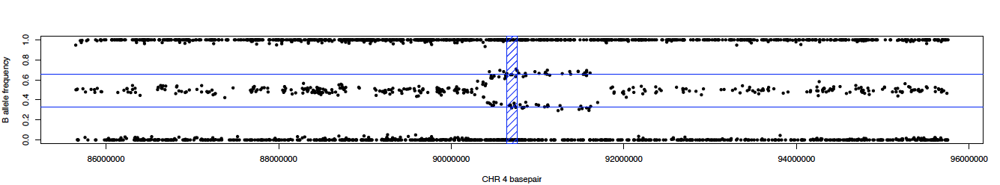
</p>


If you want to make it a bit fancier... 

Script can be found [here](https://github.com/neurogenetics/UKbiobank_SNCA/blob/master/standalone_CNV_BAF_SNCA_paper.R) @ `standalone_CNV_BAF_SNCA_paper.R`

<p align="center">
  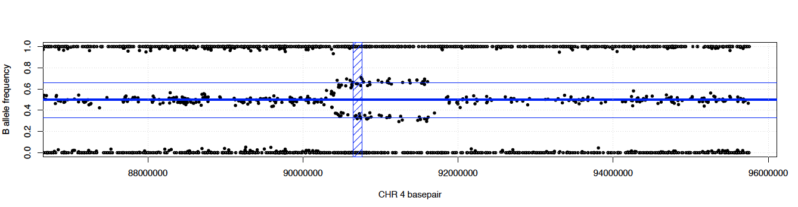
</p>


--- 
#### standalone_CNV_L2R.R

Script can be found [here](https://github.com/neurogenetics/UKbiobank_SNCA/blob/master/standalone_CNV_L2R.R) @ `standalone_CNV_L2R.R`

<p align="center">
  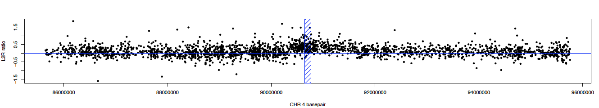
</p>


#### If you want to make it a bit fancier...

Script can be found [here](https://github.com/neurogenetics/UKbiobank_SNCA/blob/master/standalone_CNV_L2R_SNCA_paper.R) @ `standalone_CNV_L2R_SNCA_paper.R`

<p align="center">
  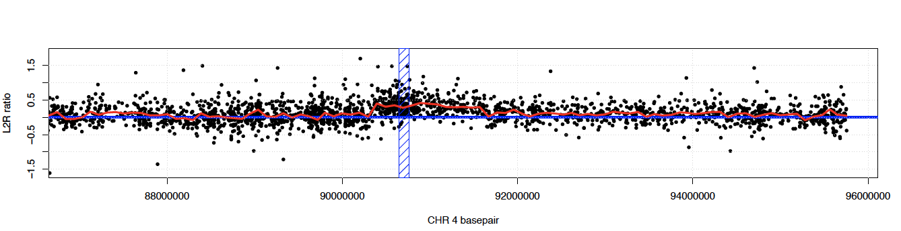
</p>

<a id="6-Results-summary"></a>
## 6. Results Summary
<a id="SNCA-results"></a>
#### 6A. SNCA Results
Manual inspection of plots in all regions resulted in the following counts for *SNCA*:

| Event Type  | Count |
| :-------------: | :-------------: |
| Duplications  | 6  |
| Deletions | 6  |
| Complex/Mosaicism? | 14  |

#### Deep Dive into these Results

What does each column mean again?
- Region 1 -- *SNCA* gene +/- 5 Mb(chr4:85645250-95759466, hg19)
- Region 2 -- *SNCA* gene +/- 0.5 Mb (chr4:90145250-91259466, hg19) 
- Region 3 -- *SNCA* gene body (chr4:90645250-90759466, hg19)

For BAF, it is the number of variants with value <0.85 and >0.65 ***OR*** <0.35 and >0.15
For L2R, it is the average L2R value in that region


#### Inspect Wider Region of "complex" Hits

Script can be found [here](https://github.com/neurogenetics/UKbiobank_SNCA/blob/master/CNV_closer_inspection.R) @ `CNV_closer_inspection.R`

Basically, very similar to `standalone_CNV_BAF.R` and `standalone_CNV_L2R.R`, but now assesses full chr4 region and wider *SNCA* region +/- 20 Mb


<p align="center">
  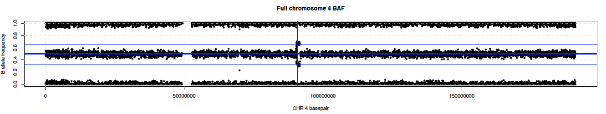
</p>


<p align="center">
  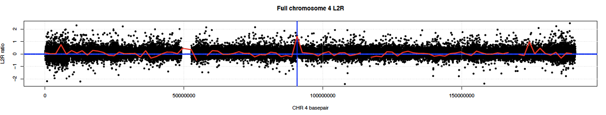
</p>


<p align="center">
  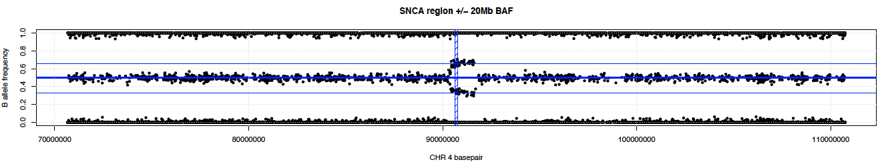
</p>


<p align="center">
  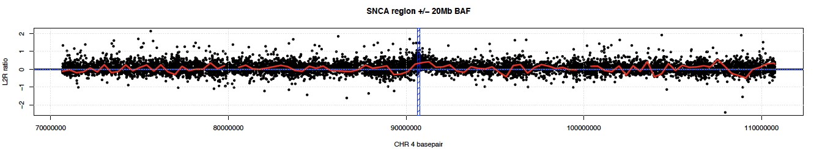
</p>


#### Inspect All Chromosomes of "Complex" Hits

Script can be found [here](https://github.com/neurogenetics/UKbiobank_SNCA/blob/master/full_chromome_plot.R) @ `full_chromome_plot.R `


Basically, very similar to `standalone_CNV_BAF.R` and `standalone_CNV_L2R.R` but now assesses all autosomes

BAF just displaying chr1-4 because easier than all chromosomes


<p align="center">
  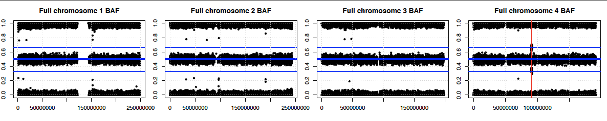
</p>


L2R just displaying chr1-4 because easier than all chromosomes


<p align="center">
  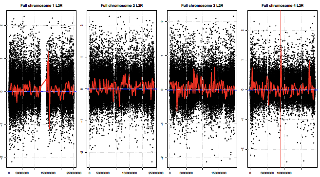
</p>


#### OK Coolio, so now what's Next?

- Try to find replication of CNVs in exome data

- Check ICD10 codes of CNVs carriers if anything stands out

- Check relatedness of CNV carriers


<a id="7-Using-Exome-data-as-potential-replication"></a>
## 7. Using Exome Data as Potential Replication?

One way of potentially "replicating" the findings of CNV is using the exome sequencing data. Specifically, the allele depth field since you would expect an imbalance there

Three samples of interest have exome data, and we will use 10 random other samples as "controls".

#### Downloading UKB Exome Data
Using Biowulf:
```bash
# Getting 10 random samples from .fam file
sort -R ukb33601_efe_chr1_v1_s49959.fam | head -n 10

# Going to directory 
cd /PATH/TO/UKBIOBANK/CNV_UKB/EXOME

# Load modules 
module load ukbb/0.1

cat UKB_ID_OF_INTEREST.txt  | while read UKBID
do 
	ukbfetch -e$UKBID -d23161_0_0 -a/PATH/TO/UKBIOBANK/UKBB_key_and_programs/application_number.key
done
```

#### Check Allelic Depth Fields in Exome Data
Using Biowulf:
```bash
# Load modules 
module load vcftools

# Reformat files to keep only chr4, only heterozygous variants and have it in the right format.
cat UKB_ID_OF_INTEREST.txt  | while read UKBID
do 
	vcftools --gzvcf "$UKBID"_23161_0_0.gvcf.gz --chr 4 --recode --recode-INFO-all --out "$UKBID"_CHR4_region
	grep "DP=" "$UKBID"_CHR4_region.recode.vcf | cut -f 1,2,9,10 | sed 's/:/\t/g' | sed 's/,/\t/g' | cut -f 1,2,9,10,11,13,14 | grep -v "1/1" | grep "0/1" > "$UKBID"_chr4.txt
done
```

#### Plot 
```bash
# Plot using the R script below
module load R

cat UKB_ID_OF_INTEREST.txt  | while read UKBID
do 
	Rscript --vanilla plot_AD_chr4.R $UKBID
done
```
What does `plot_AD_chr4.R` looks like under the hood? (Caution: using hg38 coordinates)

```R
#!/bin/env Rscript

# Allow arguments to be passed in via the command line
args = commandArgs(trailingOnly=TRUE)

# Run the script like this in the command line:
# Rscript --vanilla plot_AD_chr4.R $sampleID

# Print arguments 
SAMPLENAME = args[1]
print(args[1])
print(SAMPLENAME)

# Load necessary packages 
library(ggplot2)

# Read and restructure the data
data <- read.table(paste(SAMPLENAME,"_chr4.txt",sep=""),header=F)
colnames(data) <- c("CHR","BP","GT","AD1","AD2","DP","GQ")

# Keep only high quality variants
newdata <- subset(data, DP > 19 & GQ > 80)
newdata$ADratio <- as.numeric(newdata$AD1)/as.numeric(newdata$AD2)
newdata$ADratio2 <- as.numeric(newdata$AD2)/as.numeric(newdata$AD1)

# Set all values to >1
newdata$ADratio3 <- pmax(newdata$ADratio, newdata$ADratio2)

# Remove extreme AD ratios..
newdata2 <- subset(newdata, ADratio3 < 4)

# ggplot style: note SNCA coordinates are HG38
options(scipen=20)
newdata2$ADratio <- newdata2$ADratio3
p <- ggplot(newdata2, aes(BP,ADratio)) + geom_point() + geom_smooth()
p + annotate("rect", xmin=89724099, xmax=89838315, ymin=1, ymax= 4, 
             fill=NA, colour="red")
             
# Save the plot
ggsave(paste(SAMPLENAME,"_chr4_new_v2.pdf",sep=""), width = 20, height = 4)
```

#### Example Figure


<p align="center">
  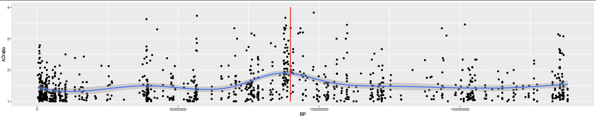
</p>

#### Optional, if you want coordinates to be in hg19

```bash
# Convert to hg19 from hg38 exome data if needed
module load crossmap

# Download reference
wget http://hgdownload.soe.ucsc.edu/goldenPath/hg38/liftOver/hg38ToHg19.over.chain.gz

# Subset columns
cut -f 1,2 $UKBID_chr4.txt > temp
cut -f 2-7 $UKBID_chr4.txt > temp2
paste temp temp2 > test.bed
crossmap bed hg38ToHg19.over.chain.gz test.bed | cut -f 10,11,13,14,15,16,17 > $UKBID_chr4.txt

# Note: Don't forget to update the SNCA region in => plot_AD_chr4.R to hg19
```


<a id="8-ICD10-code-explorer-of-CNV-carriers"></a>
## 8. ICD10 Code Explorer of CNV Carriers

#### Investigating ICD10 codes per sample of interest:

```bash
# Go to directory 
cd /path/to/UKBIOBANK/CNV_UKB/
mkdir phenotypes

# Check in known disease group
grep -f FINAL_SNCA_list.txt /path/to/UKBIOBANK/PHENOTYPE_DATA/disease_groups/* > phenotypes/disease_groups.txt

# Check in ICD10 codes
grep -f FINAL_SNCA_list.txt /path/to/UKBIOBANK/ICD10_UKBB/ICD10_codes/massive_ICD10_ALL_table.txt | sort -nk1 > phenotypes/ICD10.txt

# Check European?
grep -f FINAL_SNCA_list.txt /path/to/UKBIOBANK/ICD10_UKBB/Covariates/covariates_phenome_to_use.txt > phenotypes/covariates.txt
```
Load R to merge the ICD10 codes:

```R
# Add in ICD10 annotation
# module load R
# R

ICD10 <- read.table("phenotypes/ICD10_coding.tsv",header=T)
pheno <- read.table("phenotypes/ICD10.txt",header=F)
MM <- merge(pheno,ICD10,by.x="V2",by.y="coding")
write.table(MM, file = "phenotypes/ICD10_annotated.txt",row.names=FALSE, quote = FALSE, sep="\t")

#q()
#n

# Check for PD-ish ICD10 codes...
```
<a id="9-Relatedness-of-CNV-carriers"></a>
## 9. Relatedness of CNV Carriers
#### Checking if any if the CNV Carriers are Related using PLINK

PIHAT values, explained: 
- ~0.5 means first degree
- ~0.25 means second degree

```bash
# Load the modules 
module load plink #v1.9
module load R
module load flashpca

# Go to the proper directory
cd /path/to/UKBIOBANK/GENOTYPE_DATA

# Extract data from raw genotyes
for chnum in {1..22};
  do
  ./plink2 --bed ukb_cal_chr"$chnum"_v2.bed --bim ukb_snp_chr"$chnum"_v2.bim --fam ukb33601_cal_chr1_v2_s488363.fam \
  --keep /path/to/UKBIOBANK/CNV_UKB/SNCA_samples_moving_forward_plink.txt --make-bed \
  --out /path/to/UKBIOBANK/CNV_UKB/genotypes/SNCA_dups_"$chnum"
done

# Merge data
cd /path/to/UKBIOBANK/CNV_UKB/genotypes/

ls | grep "bim" | sed 's/.bim//g' > merge_list.txt

plink --merge-list merge_list.txt --make-bed --out MERGED

plink --bfile MERGED --maf 0.05 --geno 0.05 --hwe 5e-6 --make-bed --out MERGED_FILTER
plink --bfile MERGED_FILTER --indep-pairwise 1000 10 0.02 --autosome --out pruned_data
plink --bfile MERGED_FILTER --extract pruned_data.prune.in --make-bed --out MERGED_FILTER_PRUNE
plink --bfile MERGED_FILTER_PRUNE --genome --min 0.05 --out MERGED_FILTER_PRUNE

# investigate .genome file for high PIHAT values 
    # ~0.5 means first degree
    # ~0.25 means second degree, etc
sort -gk 10 MERGED_FILTER_PRUNE.genome | head
```
Most noteworthy samples and their PIHAT values:

| Sample1  | Sample2 | PIHAT |
| ------------- | ------------- | ------------- |
| Dup1 | Dup6  | 0.4730 |
| Del5 | Del2  | 0.5637 |


- Multiple other samples with PIHAT of ~0.125

#### Checking if any if the CNV Carriers are Related using KING

```bash
# Load modules
module load king

# Run KING
king -b MERGED_FILTER_PRUNE.bed --related

# same result 2 first degrees...
```

## 10. Additional Things to Check

#### Are *SNCA* Mutations on the UKbiobank Array (raw data)?
Check for *SNCA* mutations in ClinVar June 23 2020 
- Link to ClinVar: https://www.ncbi.nlm.nih.gov/clinvar
- Look at: SNCA[gene]; Protein change variants only

```bash
# For sure pathogenic (hg19)
grep 90756731 ukb_snp_chr4_v2.bim # Ala30Pro
grep 90749321 ukb_snp_chr4_v2.bim # Glu46Lys
grep 90749305 ukb_snp_chr4_v2.bim # Gly51Asp
grep 90749299 ukb_snp_chr4_v2.bim # Ala53Glu
grep 90749300 ukb_snp_chr4_v2.bim # Ala53Thr

# Debatable pathogenic (hg19)
grep 90749307 ukb_snp_chr4_v2.bim # His50Gln
grep 90650353 ukb_snp_chr4_v2.bim # Pro128Thr
grep 90650386 ukb_snp_chr4_v2.bim # Pro117Thr
grep 90743416 ukb_snp_chr4_v2.bim # Lys96Arg
grep 90743452 ukb_snp_chr4_v2.bim # Gly84Val
grep 90756775 ukb_snp_chr4_v2.bim # Val15Ala

# Nope, none are on there...
```

#### Are *SNCA* Mutations Identified in the UKbiobank Exome Sequencing Data?

```bash
# For sure pathogenic (hg38)
grep 89835580 ukb_fe_exm_chrall_v1.bim # Ala30Pro
grep 89828170 ukb_fe_exm_chrall_v1.bim # Glu46Lys
grep 89828154 ukb_fe_exm_chrall_v1.bim # Gly51Asp
grep 89828148 ukb_fe_exm_chrall_v1.bim # Ala53Glu
grep 89828149 ukb_fe_exm_chrall_v1.bim # Ala53Thr
# Nope, none are identified there

# Debatable pathogenic (hg38)
grep 89828156 ukb_fe_exm_chrall_v1.bim # His50Gln => yes => 4:89828156:A:C
grep 89729202 ukb_fe_exm_chrall_v1.bim # Pro128Thr => yes => 4:89729202:G:T
grep 89729235 ukb_fe_exm_chrall_v1.bim # Pro117Thr => yes => 4:89729235:G:T
grep 89822265 ukb_fe_exm_chrall_v1.bim # Lys96Arg => yes => 4:89822265:T:C
grep 89822301 ukb_fe_exm_chrall_v1.bim # Gly84Val
grep 89835624 ukb_fe_exm_chrall_v1.bim # Val15Ala
```
Check number of alleles present of the mutations identified in the exome sequencing data (done in Biowulf):
```bash
# Load module
# Check Number of Alleles
module load plink

plink --bfile --bed ukb_efe_chr1_v1.bed --bim ukb_fe_exm_chrall_v1.bim \
--fam ukb33601_efe_chr1_v1_s49959.fam --snps 4:89828156:A:C,4:89729202:G:T,4:89729235:G:T,4:89822265:T:C \
--freq --out freq_SNCA --recodeA
```
Results:
```
 CHR              SNP   A1   A2          MAF  NCHROBS
   4   4:89729202:G:T    T    G    7.006e-05    99920 => 7 alleles => all heterozygous
   4   4:89729235:G:T    T    G    0.0001301    99920 => 13 alleles => all heterozygous
   4   4:89822265:T:C    C    T    1.001e-05    99920 => 1 allele => all heterozygous
   4   4:89828156:A:C    C    A    0.0002802    99920 => 28 alleles => all heterozygous
```

Any PD-ish phenotype for these carriers?

```bash
# Checking PD parent or PD status 
sort -nk 7 freq_SNCA.raw | tail -8 | head -7 | cut -d " " -f 1 > SNCA_carriers.txt
sort -nk 8 freq_SNCA.raw | tail -14 | head -13 | cut -d " " -f 1 >> SNCA_carriers.txt
sort -nk 9 freq_SNCA.raw | tail -2 | head -1 | cut -d " " -f 1 >> SNCA_carriers.txt
sort -nk 10 freq_SNCA.raw | tail -29 | head -28 | cut -d " " -f 1 >> SNCA_carriers.txt

wc -l SNCA_carriers.txt # 49 so makese sense => 7+23+1+28

/path/to/UKBIOBANK/EXOME_DATA/PLINK_files/SNCA_carriers.txt

# Three have a parent with PD:
    # sampleID1 => 4:89729235:G:T => Pro117Thr
    # sampleID2 => 4:89828156:A:C => His50Gln
    # sampleID3 => 4:89828156:A:C => His50Gln
```

#### Annotation using ANNOVAR
Done using Biowulf
```bash
# Prep exome data (hg38)
cd /path/to/UKBIOBANK/EXOME_DATA/PLINK_files/
module load plink

# Subset SNCA
plink --bed ukb_efe_chr1_v1.bed --bim ukb_fe_exm_chrall_v1.bim \
--fam FAM_FILE.fam --chr 4 --from-bp 89724099 --to-bp 89838315 --make-bed --out SNCA_only

# Reformat for ANNOVAR
cut -f 1,4 SNCA_only.bim > temp.txt
cut -f 4,6 SNCA_only.bim > temp2.txt
cut -f 5 SNCA_only.bim > temp3.txt
paste temp.txt temp2.txt temp3.txt > to_annotate.txt

# Annotate
module load annovar

table_annovar.pl to_annotate.txt $ANNOVAR_DATA/hg38/ -buildver hg38 -out to_annotate_anno \
-remove -protocol refGene,avsnp150,gnomad211_genome,clinvar_20200316 \
-operation g,f,f,f -nastring . 

# Prep imputed data (hg19)
cd /path/to/UKBIOBANK/IMPUTED_DATA/

# Subset SNCA
module load plink/2.3-alpha

plink2 --bgen ukb_imp_chr4_v3.bgen --make-bed --out SNCA --memory 230000  --threads 20 \
--sample SAMPLE_FILE.sample --chr 4 --from-bp 90645250 --to-bp 90759466

module load plink

plink --bfile SNCA --make-bed --out SNCAv2

# Reformat for ANNOVAR
cut -f 1,4 SNCAv2.bim > temp.txt
cut -f 4,6 SNCAv2.bim > temp2.txt
cut -f 5 SNCAv2.bim > temp3.txt
paste temp.txt temp2.txt temp3.txt > to_annotate.txt

# Annotate
module load annovar

table_annovar.pl to_annotate.txt $ANNOVAR_DATA/hg19/ -buildver hg19 -out to_annotate_anno \
-remove -protocol refGene,avsnp150,gnomad211_genome,clinvar_20200316 \
-operation g,f,f,f -nastring . 
```

## Done


